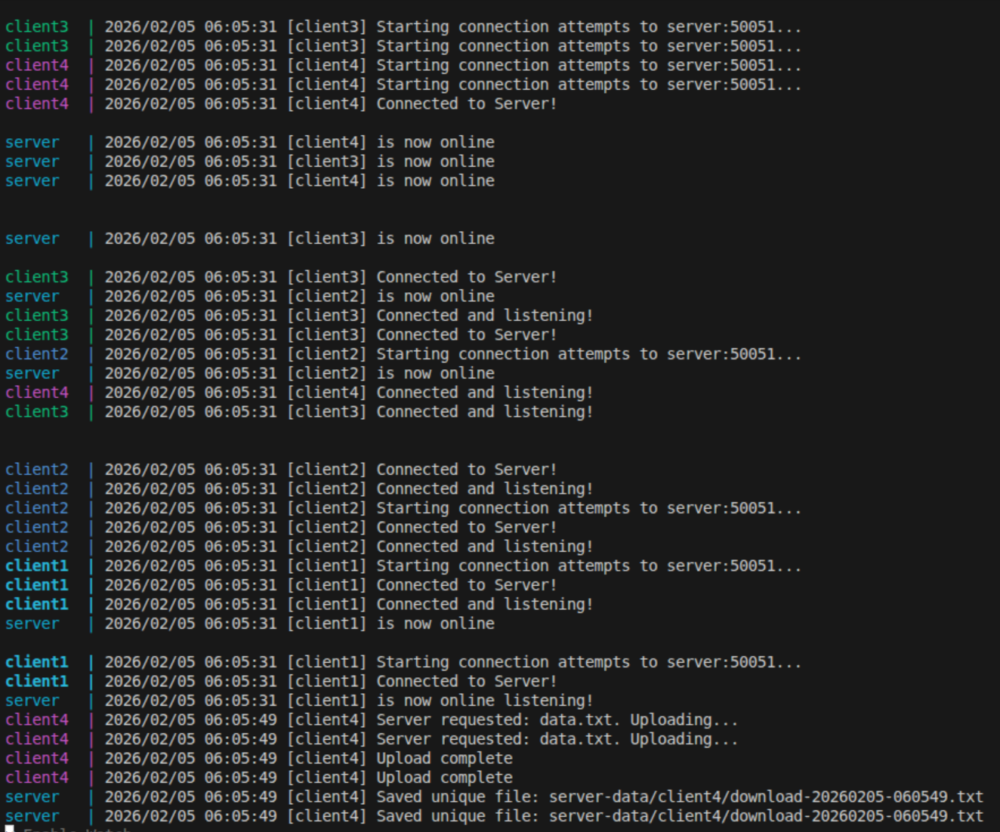

## Project Design

Project Design: How it Works
1. Handling the Private Network (The Connection)

The main challenge was that the clients (at the restaurants) are behind firewalls, so the server can’t "call" them directly. To fix this, I made the Client call the Server.

    The client connects to the server and keeps the line open.

    This "reverses" the connection so it works on any private network without needing special router settings or a VPN.

2. Triggering the Download (The API)

Even though the client starts the connection, the Server still decides when to start the download.

    I added a simple HTTP API on the server.

    When you hit the /trigger?id=client1 URL, the server finds that client's open connection and sends a "Start Download" message down the pipe.

    This satisfies the "on-demand" requirement using a CLI command like curl.

3. Transferring the 100MB File (The Stream)

Since the file is 100MB, I didn't want to load the whole thing into memory, which could crash the app.

    I used gRPC Streaming. The client breaks the file into 64KB chunks and sends them one by one.

    The server catches these chunks and writes them directly to the disk.

4. Keeping Data Safe & Unique

To make sure files don't get mixed up or corrupted:

    Unique Folders: Every client gets its own folder on the server based on its ID.

    Timestamps: Every finished download is saved with a timestamp (like download-20260205-1400.txt). This prevents new downloads from overwriting old ones.

    Temp Files: The server writes to a .tmp file first. It only saves the real file once the client says the upload is 100% finished.

## Requirement

 - Docker version 28 or newer
 - Go 1.25 or newer

## How to run

 - chmod +x setup.sh
 - ./setup.sh
 - docker compose up --build

## How to use

 - make sure server and client already connected and listening like this
 
 - hit api using curl or postman | curl "http://localhost:8080/trigger?id=client4"
 - check the server-data directory to ensure file downloaded successfully

Note: this code tested at linux, if you are using windows just open the setup.sh and follow, or just change the alternative command that equivalent in windows as well

